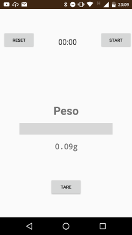
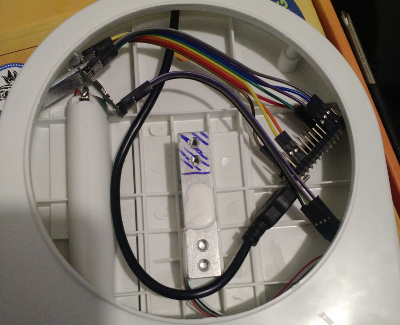
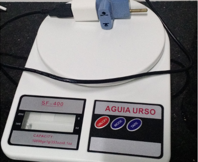
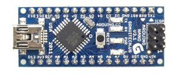
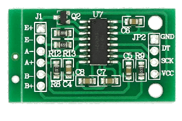
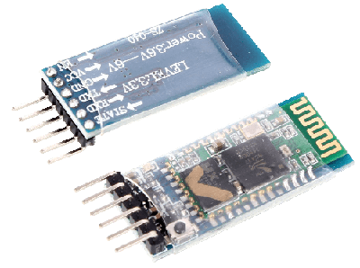
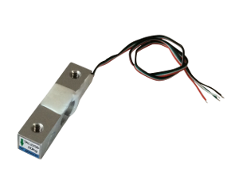
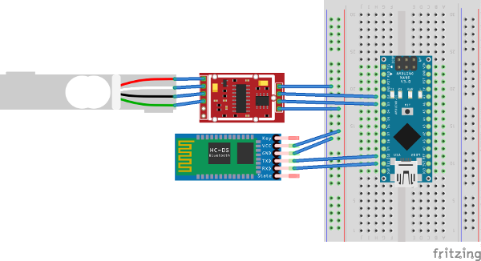

# ascale

[para português veja o final da página]

This project is a digital scale that can be used as a kitchen scale. The
original objective was to build a coffee brewing scale with a timer, more
or less a clone of the
[Hario Drip Scale](http://www.hario.jp/seihin/productgroup.php?group=VST-2000B).
While prototyping I was missing the LCD and some push buttons, so the thing
moved all to android.

The goal now `ascale` is to provide people an easy way for a kitchen scale DIY.

Inside this repository you will find tree parts:

- arduino project that contains the code to run inside an arduino
- android project with the UI to interact with the scale
- [TODO: ios project]

## Bill of materials

- Arduino.  I have used a [Freaduino Uno](https://www.elecfreaks.com/wiki/index.php?title=Freaduino_UNO)
  at first, it offers a lot of extra pins. In the final version I replaced with an
  [Arduino Nano](https://store.arduino.cc/usa/arduino-nano). You can use any
  that you have spare.

    

- [HX711](https://www.sparkfun.com/products/13879)

  

- Bluetooth module [HC-05](https://www.amazon.com/s/ref=nb_sb_noss_2?field-keywords=hc-05)

  
- [Load Cell](https://www.sparkfun.com/products/13329) (you can also buy an
  off the shelf scale and dismantle it, if you want the casing too.)

  

## Assembly

Vcc and GND are not specified, but of course you should connect to the Vcc and
GND on your arduino board.

| Load Cell | HX711 | - | HX711 | Arduino | - | HC-05 | Arduino |
|-----------|-------|---|-------|---------|---|-------|---------|
| red       | E+    | . | rx    | D2      | . | rx    | D11     |
| white     | E-    | . | tx    | D3      | . | tx    | D10     |
| black     | A+    |
| green     | A-    |

#### How it is supposed to look:

## Scale Message Protocol

As soon as you turn on the scale it is going to start sending messages through
bluetooth. The only thing you need to do is to pair and connect to the board,
as soon as you open your serial input stream in your client you will see theses
messages:

    // incoming data
    {'weight': '0.6441', 'unit': 'g'}

And this is all you have to interpret if you build a client.

The `tare` function is through sending `"t"` to the client outstream channel.

# Em Português

### Lista de Materiais

Para este projeto você vai precisar dos itens abaixo. Todos eles podem ser
encontrados facilmente no Mercado Livre e nenhuma solda é necessária.

- arduino (R$ 20)
- driver para celula de carga, chamado HX711 (R$ 8)
- célula de carga de 2 kg (pode ser usado outras, mas muda a precisão) (R$ 24)
- módulo bluetooth (HC-05 ou HC-06) (R$ 25)

Total em em torno de R$ 80.
